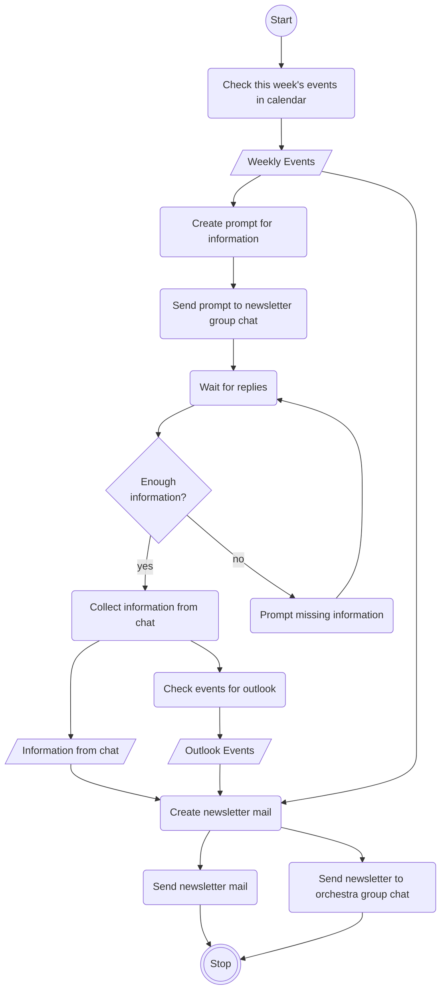

To be honest, I am an AI[^1] skeptic.
Even though it's my job as a data and AI consultant to build AI-driven solutions for customers, I do not share the hype.
The problem is not the technology itself[^2], but the way people and businesses approach it.
They see AI as this technological marvel, the solution for all their problems, without even knowing what these problems are exactly.
More often than not, AI projects are done out of vanity to proudly declare on LinkedIn that they, too, are an AI company.
Frequently, the problem to solve is ill-defined, and sometimes the best solution does not involve AI at all.

Nevertheless, AI has its uses and lets us build and automate things we didn't even dream of a few years back.
I wanted to solve a real problem with AI as an exercise and see how much value it brings.
Being a personal project, I had total control and wanted to enforce one more constraint: being as digitally independent as possible.
This means, no US hyperscalers for infrastructure and no US LLM providers.
As a European, I wanted to check just how challenging things would get if we got cut off from these companies[^3].
Given these constraints, I had the perfect problem.

I’ve been a member of an orchestra in my hometown since childhood.
Although I only get to play my chosen instrument a few times each year, I'm still active in the orchestra's board.
Due to my profession, most tasks that can be done digitally fall into my domain, such as the problem at hand: writting the weekly newsletter.
This newsletter is an e-mail with all important dates for the week, reminders, and an outlook of events in the next few weeks.
The newsletter is also cross-posted into the orchestra's WhatsApp[^4] group chat.
Compiling this newsletter means checking several sources for information and bringing them together in a few well-written paragraphs.
You can see the weekly process in the flowchart below.



A lot of this process is inactive time, waiting for others to reply.
The active tasks ordered by effort needed and time consumed are:

1. **Checking for completeness:** verifying that all information for compiling the newsletter is available needs concentration and is error-prone. More often than not, I notice that something is missing while writing the newsletter text.
2. **Writing the newsletter:** compiling the collected information into continuous text takes the most time.
3. **Looking up information:** cross-referencing the calendar, messages, and information from the internet is especially hard when on mobile. Multitasking on a smartphone is more than annoying.

Task three is the easiest.
The orchestra's calendar is public and can be retrieved via API.
Messages can be collected directly from the chat and stored until compiling the newsletter.
Task two is a typical LLM problem.
There is no doubt that an LLM can write an adequate text given the appropriate information and suitable guidelines.
Task one is the most complex.
An LLM should be able to do it, but it needs guidelines on what to look for.
An automated completeness check would need extensive evaluation before I would deem it trustworthy.

As an incomplete solution is better than no solution, I decided to automate the last two tasks in a first attempt and leave the first task optional.
Next, I needed to decide on a platform to orchestrate my automation with.

## n8n - AI Automation Platform

The platform I hear a lot about these days on LinkedIn and daily.dev ist [n8n](https://n8n.io).
It is a fair-code[^5] automation platform with builtin AI capabilities and a lot of integrations for various services.
Luckily, n8n is a German unicorn startup, which makes it perfect for my digital independence constraint.
Self-hosting is free and simple, as well, with pre-built Docker images.
Using the [docs](https://docs.n8n.io/hosting/installation/docker), I came up with this Docker compose file:

```yaml
services:
  n8n:
    image: n8nio/n8n:1.123.16
    container_name: n8n-main
    environment:
      - GENERIC_TIMEZONE=Europe/Berlin
      - TZ=Europe/Berlin
      - N8N_RUNNERS_ENABLED=true
      - N8N_RUNNERS_MODE=external
      - N8N_RUNNERS_BROKER_LISTEN_ADDRESS=0.0.0.0
      - N8N_RUNNERS_AUTH_TOKEN=<your auth token>
      - N8N_NATIVE_PYTHON_RUNNER=true
      - WEBHOOK_URL=<your domain>
      - N8N_PROXY_HOPS=1
      - DB_SQLITE_POOL_SIZE=10
      - N8N_GIT_NODE_DISABLE_BARE_REPOS=true
      - N8N_BLOCK_ENV_ACCESS_IN_NODE=true
    ports:
      - "5678:5678"
    volumes:
      - n8n_data:/home/node/.n8n

  task-runners:
    build: .
    container_name: n8n-runners
    environment:
      - N8N_RUNNERS_TASK_BROKER_URI=http://n8n-main:5679
      - N8N_RUNNERS_AUTH_TOKEN=<your auth token>
    depends_on:
      - n8n

volumes:
  n8n_data:
```

This setup uses an SQLite database, as the instance only needs to support a single user, me.
My instance runs behind a reverse proxy on my Strato VPS so `N8N_PROXY_HOPS` is set to one and `WEBHOOK_URL` to one of my domains.
The setup uses a separate container to host JS and Python task runners, making it more robust than a single container setup.
As I needed some third-party packages for my Python runners, I created a custom runner image as advised by the [docs](https://docs.n8n.io/hosting/configuration/task-runners/#adding-extra-dependencies):

```dockerfile
FROM n8nio/runners:1.123.16
USER root
RUN cd /opt/runners/task-runner-python && uv pip install icalevents pytz
COPY n8n-task-runners.json /etc/n8n-task-runners.json
USER runner
```

At last, the packages needed to be added to an allowlist by modifying the default `n8n-task-runners.json` file from the [repository](https://github.com/n8n-io/n8n/blob/master/docker/images/runners/n8n-task-runners.json).

```json
{
	"task-runners": [
		{
			"runner-type": "javascript",
			//...
		},
		{
			"runner-type": "python",
			// ...
			"env-overrides": {
                // ...
				"N8N_RUNNERS_STDLIB_ALLOW": "json,datetime,time",
				"N8N_RUNNERS_EXTERNAL_ALLOW": "icalevents,pytz"
			}
		}
	]
}
```

With this configuration done, the n8n instance is running on the VPS bound to `localhost`.
It is not accessible from the internet but can be reached by ssh port forwarding.
This gives less attack surface to any would-be hackers.
Next, we need to figure out how the automation workflow communicates with the outside world.

## The _Chat_ in Chatbot

As mentioned above, most communication in our orchestra happens over WhatsApp.
My ideal version of the automated workflow would, therefore, be a chatbot that participates in the group chat: supplying context, parsing information from messages, and sending the newsletter draft for review.
Fortunately, n8n comes with a WhatsApp cloud API integration, so I set out to get some credentials.


Turns out, WhatsApp (or more specifically Meta) wants only businesses to send automated messages.
Therefore, you need WhatsApp business credentials.
First, you need a Facebook account, which I didn't have anymore.
So I created an e-mail alias and with it a new Facebook account.
Using this account, I set up a Meta Business Portfolio.
Inside this portfolio, I created an app that includes the WhatsApp use case.
To activate the use case, I needed a phone number without an associated WhatsApp account, so I ordered a free prepaid esim.
Getting the esim was surprisingly the fastest and most straight forward step.
With this new phone number and a credit card for payment information, I was able to activate the WhatsApp use case.
At last, I needed to create a system user with permissions on the app to receive an API key.
After several hours of setup, one day waiting for my account to be old enough to create a business portfolio, the API key did not work.
Even several additional hours of bug fixing did not solve the issue, so I resignated.


After failing miserably to acquire WhatsApp credentials, I needed another chat provider.
My collaborators were unwilling to migrate away from WhatsApp, so the chatbot will have to communicate with me on another platform, and I will forward the messages.
This prevents my previous idea of full automation, but copying some messages would still be less work than before.

For personal communication, I try to use Signal as much as possible because it is free, open-source, and end-to-end encrypted.
Unfortunately, Signal does not have an official bot API, and the inofficial ones seemed finicky to set up.
If Signal does not want bots on their platform, I respect that.

This leaves Telegram.
Just a few weeks before, I deleted the app from by phone because I successfully moved all contacts to Signal, so I was hesitant at first.
But you have to leave it to Telegram, as setting up bot API credentials took less than a minute.
The `@botfather` asks for your bot's display name and handle and supplies an API key.
That's it!

Now I had one last issue to fix.
Given the n8n setup above, the instance could send messages but not receive it, as all incoming traffic is blocked by nginx.
I still wanted to avoid revealing the instance to the open web, so I used the following addition to my nginx config:

```nginx
server {
  # ...

  location /n8n/ {
    # Allow Telegram bot subnets
    allow 149.154.160.0/20;
    allow 91.108.4.0/22;

    # Deny all other IPs
    deny all;

    proxy_pass http://localhost:5678/;
    proxy_buffering off;
    proxy_set_header X-Real-IP $remote_addr;
    proxy_set_header X-Forwarded-Host $host;
    proxy_set_header X-Forwarded-For $proxy_add_x_forwarded_for;
    proxy_set_header X-Forwarded-Port $server_port;
    proxy_set_header X-Forwarded-Proto $scheme;
    proxy_pass_request_headers on;
  }

  # ...
}
```

This makes n8n available at `<my_domain>/n8n/` but restricts incoming traffic to the [subnets used by Telegram](https://core.telegram.org/resources/cidr.txt).
Nginx passes the traffic to localhost with headers set as described in the [docs](https://docs.n8n.io/hosting/configuration/configuration-examples/webhook-url/).
Certificates for HTTPS are handled by [certbot's nginx integration](https://certbot.eff.org/instructions) (not included in the snippet).
With inputs and outputs defined, I could move on to creating the real automation logic.

## Creating the Weekly Prompt

The first piece of the automation workflow is writing the weekly prompt.
It is a one-paragraph summary of the week's events and a request for additional information.
The events need to be sourced from the orchestra's public Google calendar.

This part of the workflow is triggered by a _Schedule Trigger_ set to 10:00 each Monday.
I didn't want to connect my personal Google account to n8n, so I opted for reading the calendar as an ICS file.
Unfortunately, there is no builtin parser node, and I didn't want to bother with installing community nodes, so I used the _Code Node_ to execute a Python script:

```python
import datetime

import icalevents.icalevents
import pytz

calendar_id = "<calendar_id>"
ics_url = f"https://calendar.google.com/calendar/ical/{calendar_id}/public/basic.ics"
tz = pytz.timezone("Europe/Berlin")
now = datetime.datetime.fromisoformat(_items[0]["json"]["timestamp"])
end_date = now + datetime.timedelta(days=7)
cal = icalevents.icalevents.events(ics_url, end=end_date, sort=True)

return [
  {
    "summary": e.summary,
    "location": e.location or "",
    "start": e.start.strftime("%A %H:%M"),
    "end": e.end.strftime("%A %H:%M"),
  }
  for e in cal
]
```

The script takes the timestamp from the trigger node and fetches the calendar events for the next seven days.
It then converts the events into a list of dictionaries.
The start and end timestamps of each event are converted to weekday and time, because this is how they should be formatted in the prompt.

Each event is now a workflow item, which would be processed separately.
But the LLM needs all events at once, so the _Aggregate Node_ merges them into a single item.
This feeds into an _LLM Chain Node_ whose system prompt boils down to: take these event JSONs and encode them in a paragraph of text.
Additionally, the system prompt contains instructions on tone and conventions.
There are, for example, two common rehearsal locations, which should only be referred to as "the theater" and "the school."
Without this instruction the LLM would write out the whole name of the location each time, which would sound jarring for the reader.

I chose [Mistral](https://mistral.ai) as the model provider, mainly because it is European.
Additionally, they have a free API usage plan, which is more than enough for this project.
The `mistral-small` model proved itself sufficient for generating the prompt and provides low-latency responses.
At last, the final prompt is sent to my Telegram account so that I can forward it to WhatsApp.

## Collecting Information from Messages

My collaborators in the group chat are prompted to supply information, so now I needed a way to store their replies.
The _Data Table Node_ provides the perfect solution by offering lightweight database tables directly in n8n.
No external database server needed.

The _Telegram Trigger_ starts this part of the workflow each time a message is received.
The trigger node supports user ID restrictions so that the bot only reacts to my Telegram account.
If the message is not a bot command, like `\reset`, it stores the message text in the `messages` data table.
This way, the messages for the current week can be retrieved by filtering by creation timestamp.

To avoid filling the table with more and more messages, a `Data Table Node` is connected to the _Schedule Trigger_ to delete all messages of the previous week.

## Bringing Everything Together

As outlined above, the newsletter needs three types of information:

1. the events for this week,
2. the messages with additional information,
3. and the events of the next fews weeks for the outlook.

The messages are already persisted in a data table, so why not store the other pices of information there, too?
I piped the week's events fetched by the scheduled workflow part into a separate data table.
Then a slightly modified copy of the _Code Node_ fetches the events for the outlook:

```diff
import datetime

import icalevents.icalevents
import pytz

calendar_id = "<calendar_id>"
ics_url = f"https://calendar.google.com/calendar/ical/{calendar_id}/public/basic.ics"
tz = pytz.timezone("Europe/Berlin")
now = datetime.datetime.fromisoformat(_items[0]["json"]["timestamp"])
+ start_date = now + datetime.timedelta(days=7)
+ end_date = now + datetime.timedelta(days=38)
+ cal = icalevents.icalevents.events(ics_url, start=start_date, end=end_date, sort=True)
- end_date = now + datetime.timedelta(days=7)
- cal = icalevents.icalevents.events(ics_url, end=end_date, sort=True)

return [
  {
    "summary": e.summary,
    "location": e.location or "",
+   "start": e.start.isoformat(),
+   "end": e.end.isoformat(),
-   "start": e.start.strftime("%A %H:%M"),
-   "end": e.end.strftime("%A %H:%M"),
  }
  for i, e in enumerate(cal)
+ if not (e.summary == "Probe" or e.summary.startswith("Probe "))
]
```

This pulls the events for the next 30 days after the current week.
The timestamps are formatted as ISO strings this time as more specific date infos are needed.
At last, all events that are likely rehearsals are filtered out, as they are unimportant for the outlook.

With all pieces in separate data tables, I needed to combine them into a single workflow item.
First, all rows from each table are fetched and aggregated into a single workflow item.
This leaves us with one item for each table.
Fortunately, the _Merge Node_ is intended for such use cases.
It can be used like an SQL join, but needs a join key.
As all items should be joined into a single item, I used the _Set Node_ to add a dummy `"id": 0` field to each item.
With custom SQL mode, the _Merge Node_ can use this code:

```sql
SELECT * FROM input1
  LEFT JOIN input2 ON input1.id = input2.id
  LEFT JOIN input3 ON input1.id = input3.id
```

to produce an item that looks like this:

```json
[
  {
    "id": 0,
    "messages": [
      // ...
    ],
    "weeklyEvents": [
      // ...
    ],
    "outlook": [
      // ...
    ]
  }
]
```

This input was all I needed to make the LLM do its thing.

## Compiling the Newsletter

As the context for the LLM was already prepared, a simple _LLM Chain Node_ was enough to do the rest.
The user prompt template is as follows:

```
Nachrichten:
{{ JSON.stringify($json.messages, null, 2) }}

Termine:
{{ JSON.stringify($json.weeklyEvents, null, 2) }}

Ausblick:
{{ JSON.stringify($json.outlook, null, 2) }}
```

This pretty-prints the JSON of each information type under its own heading.
Using a short instruction as the system prompt produced the most AI-sounding newsletter ever: tons of emojis, excessive use of Markdown, and an annoyingly upbeat tone.
Again, the LLM was missing guidelines on my personal way of writing and knowledge.
For example, if there is no other mention of it, the mail should state the default rehearsal time for the youth orchestra before the regular rehearsal.

It is surprisingly hard to spell out instructions for such things, as I do it mostly subconsciously.
Luckily, I had been writing these mails for nearly ten years, so I had a lot of example data.
Feeding a few representative newsletters from the previous year to the Mistral chat produced suitable guidelines on the structure of the newsletter, tone, commonly used phrases, and important information to always include.
I then added some personal knowledge manually and prohibited the use of Markdown.
The result was a much more digestible, not overtly AI-generated text that I would be willing to send out.

The workflow sends this generated newsletter to my Telegram account when it receives the `/compile` bot command.
For the time being I do not want the workflow to send mails itself.
Again, I would need to connect my personal Google account to do so, which seems like a security risk to me.

## Conclusion

And with that, the workflow was complete.
My new weekly process, which I validated for the last few weeks, is:

1. receive weekly prompt on Telegram
2. copy it to the WhatsApp group chat
3. wait for responses and copy them to Telegram
4. trigger newsletter generation with `/compile`
5. check for errors
6. send mail and forward it to WhatsApp chat

It's not perfect, but it works.
If I had to estimate, it saves me at least 1-2 hours each week.
Additionally, I expect errors in the newsletter to drop because I don't have to write it while multitasking other stuff.
Also, I find checking for errors in text I did not write myself much easier.

Nevertheless, there are several things I'd like to improve for a version 2.0.
First and foremost, I would integrate the chatbot into WhatsApp directly and let it send the mail itself after review.
After I finished building the workflow, I found some promising community nodes that integrate with [Evolution API](https://github.com/EvolutionAPI/evolution-api) or [Baileys](https://github.com/WhiskeySockets/Baileys), which would make WhatsApp communication possible.
A separate mail account for the bot would solve the issues with connecting my Google account.
Not needing to copy messages around would be a tremendous improvement to the bot's UX.

In terms of missing features, the completeness check mentioned above would be on top of the list, too.
If it works, it would reliably reduce missing or unclear bits of information.

Right now, the bot's workflow is pretty rigid and only uses AI for generating text.
If a newsletter needs to include a longer outlook or an additional calendar event from the coming week, I couldn't do it easily.
By using n8n's _Agent Node_, I could surface the calendar and messages as tools for an AI agent.
This would give me much more flexibility, but make the behavior of the bot harder to reason about.
On the other hand, it would give me an excuse to try out n8n's [evaluation capabilities](https://docs.n8n.io/advanced-ai/evaluations/overview/).

Overall, I am really satisfied with this project and n8n overall.
Could this automation workflow have been a Python script?
Definetelly!
Was developing it with n8n much easier and more enjoyable?
Absolutely!
Executing nodes separately and out of order reminded me of Jupyter Notebooks.
It avoids needing to run the whole workflow for testing out localized changes.

In terms of digital independence, I count this project as a win, too.
The platform, compute and AI are all of European origin.
Sure, the boundaries, i.e., Telegram, WhatsApp and Google Calendar, are still problematic in this regard.
But I could not rationalize migrating all of this for the sake of a personal experiment.
Maybe, over time, I can convince my collaborators in the orchestra to go more independent.

I will continue to evaluate this new workflow in the upcoming weeks.
Up until now, I feel validated in what I stated in the introduction: AI has its use cases.
You just need to find them.

[^1]: within this post, AI refers to LLMs
[^2]: although the environmental impact is concerning
[^3]: obviously the problem runs deeper than software, but I know of no European hardware provider yet
[^4]: and there goes digital independence down the drain already
[^5]: [fair-code](https://faircode.io) is an interesting concept that may warrant a blog post of its own